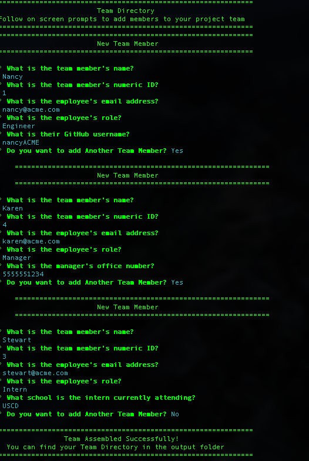
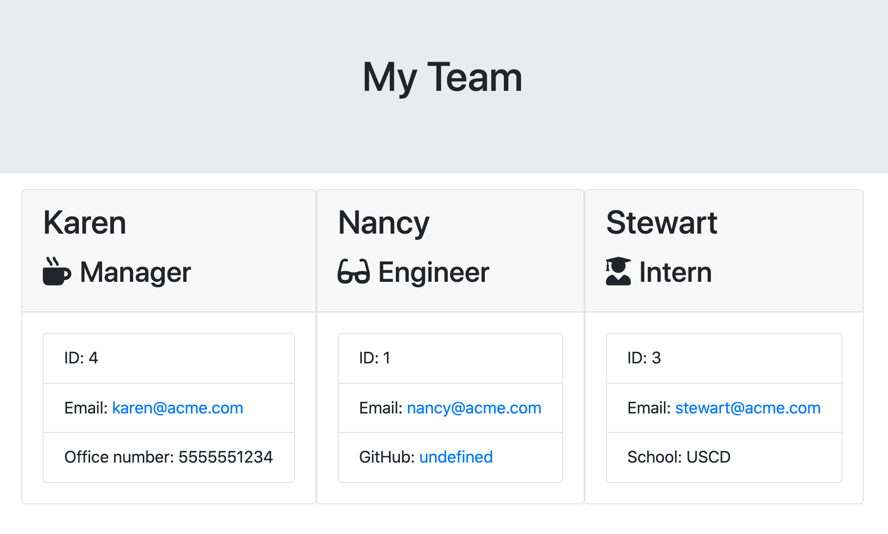

# teamDirectory


[](https://www.gnu.org/licenses/gpl-3.0)

## Description

A command line application that generates an HTML file that displays an engineering team's basic info for quick access to emails and GitHub profiles

## Table of Contents

* [Installation](#installation)
* [Usage](#usage)
* [Contributing](#contributing)
* [Support](#support)
* [License](#license)

## Installation

*Requires Node.js to run*

Download and save the contents of this repo

Using your preferred console, navigate to the program's root folder (./teamDirectory/). and run
```
npm install
```
all dependencies listed in package.json will be installed.

## Usage
After installation, run the following command in the working directory:
```
node app.js
```
Follow the in console prompts to fill in the required fields for each employee to be added to the team. . [This Video](https://drive.google.com/file/d/1sW5d1VBzsSB6ke00nE881DNrLXIXPftJ/view) demonstrates the use of the program.





The generated file is saved in (./teamDirectory/output/team.html) and is overwritten each time the program is run.

## Credits:

Thanks to support from our study group:

- [Plover Brown](https://github.com/rebgrasshopper)
- [Elliott Jones](https://github.com/JonesElliott)
- [Tim Sanders](https://github.com/tbsanders5)
- [Nick Konzen](https://github.com/NTKonzen)


## Tests:

Tests for the JavaScript classes underpinning the project's functionality are included in the /tests directory.


## Contributing

No contributions are currently being accepted for this project.

## Support

For support regarding this project please contact me via GitHub

## License

This project is licensed under the MIT License.